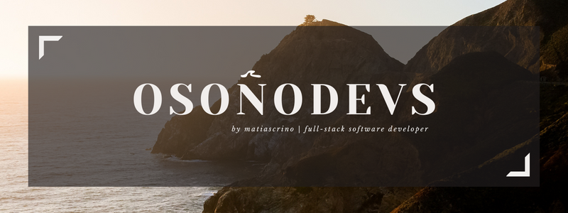

# Hola, mi nombre es Matias Crino 👋

### *Full-Stack Developer* 👨🏽‍💻

## Mi Historia

Como Ingeniero Industrial, tuve la increíble oportunidad de trabajar en diversas áreas de grandes empresas de consumo masivo. Trabajé en marketing, ventas, data analytics y finanzas, lo que me permitió comprender en profundidad el funcionamiento del negocio y adquirir valiosas habilidades interdisciplinarias.

Hace 2 años, tomé la decisión de ampliar mi perfil profesional adquiriendo conocimientos en desarrollo de software, con el objetivo de implementar soluciones de manera más eficiente. En la actualidad, estoy a punto de finalizar mi formación en Certified Tech Developer en Digital House. 

Impulsado por mi profundo interés en las últimas tendencias tecnológicas, decidí dedicarme por completo al desarrollo de software como profesional independiente, dando origen a OsoñoDevs. Esta empresa refleja mi pasión por crecer en la industria del desarrollo de software y tiene la misión de impulsar la transformación empresarial a través de la tecnología.

Estoy comprometido a seguir aprendiendo y creciendo en este campo, con el objetivo de contribuir al desarrollo de soluciones tecnológicas. 

Creo firmemente que la tecnología es la clave para fomentar la innovación y la eficiencia en cualquier organización.

Si buscas profesionalismo y dedicación, ¡contá conmigo!

## Habilidades

## Contacta conmigo

